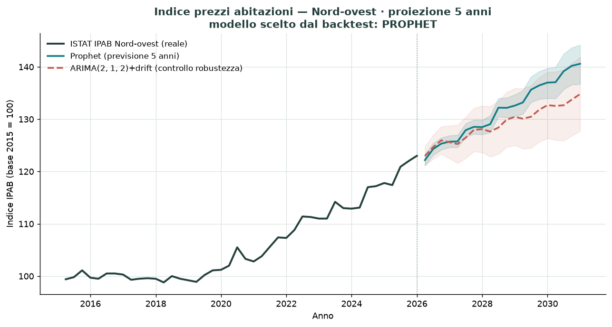

# Andora Real Estate — stima a 5 anni, Via Aurelia 111 (SV)

Progetto di analisi predittiva immobiliare a **due modelli**:

- **MICRO — valore oggi** (`Random Forest`, scikit-learn): stima il prezzo di
  vendita dai servizi della singola casa (`metratura, piano, ascensore,
  classe_energetica, distanza_mare, box_auto`), con le quotazioni **OMI zona B3
  Andora** integrate come baseline di zona.
- **MACRO — trend a 5 anni** (`Prophet` **+** `ARIMA`): proietta l'indice ISTAT
  dei prezzi delle abitazioni e ne ricava un **coefficiente di rivalutazione**.
- **Inferenza**: `predict_future_price(features, anni)` = prezzo RF di oggi ×
  (1 + rivalutazione macro attesa).

## La correzione metodologica (il punto del progetto)

Applicare l'**indice nazionale** a un appartamento sul litorale di Andora è un
errore: una località turistica ligure (seconde case, domanda turistica e di
investitori) non segue il ciclo nazionale. Perciò il modello macro usa il
livello territoriale **Nord-ovest** (`REF_AREA=ITC`), il dettaglio più fine
realmente pubblicato per l'IPAB — la singola regione Liguria **non** è esposta
nel dataflow. La serie è scaricata **dal vivo** via API SDMX:

```
esploradati.istat.it/SDMXWS/rest · dataflow 143_497 · serie Q.ITC.59.4.ALL
(trimestrale · Nord-ovest · indice base 2015=100 · abitazioni totali)
```

Dati **reali**: 44 trimestri 2015-Q1 → 2025-Q4 (99.4 → 123.0, **+23,7%** in
10 anni, quasi tutto post-2020).

### Prophet **e** ARIMA (non solo Prophet)

Prophet dà il meglio con tante osservazioni ad alta frequenza; su una serie
**trimestrale corta (~44 punti)** è fragile. Quindi si stimano **entrambi** i
modelli e si sceglie quello col **RMSE minore in backtest** (holdout sugli
ultimi trimestri). ARIMA usa una griglia su `(p,d,q)` **con termine di drift**
(indispensabile per una serie in trend, altrimenti proietta piatto).

## Uso

```bash
pip install -r requirements.txt
python src/data_fetcher.py      # scarica ISTAT (live), OMI, genera il micro dataset
python src/model_pipeline.py    # MICRO + MACRO + predict_future_price per Via Aurelia 111
python src/make_report_assets.py  # grafico Prophet vs ARIMA -> reports/
```

Oppure i notebook in ordine: `01_data_collection` → `02_eda_andora` →
`03_modeling_forecasting`.

## Risultato (dati correnti)

| | valore |
|---|---|
| Prezzo **oggi** (RF), civ. 111 (85 m², piano 3, ascensore, classe D, stato 3/4, 0,2 km mare, box) | **≈ 307.000 €** |
| Backtest macro | Prophet RMSE ≈ 1,0 · ARIMA(2,1,2)+drift RMSE ≈ 4,0 → **Prophet** |
| Rivalutazione Nord-ovest a 5 anni | **≈ +14%** (CAGR ≈ +2,7%/anno) |
| Prezzo **atteso a 5 anni** | **≈ 351.000 €** |
| **Forbice a 5 anni** | **≈ 314.000 – 388.000 €** |

Metriche micro (5-fold): MAE ≈ 24k €, RMSE ≈ 31k €.



## Struttura

```
andora_real_estate/
├── data/
│   ├── raw/         # istat_ipab_nordovest.csv (cache reale), omi_b3_andora.csv
│   └── processed/   # compravendite_andora.csv (micro dataset)
├── notebooks/       # 01 raccolta · 02 EDA · 03 modeling+forecasting (eseguiti)
├── src/
│   ├── data_fetcher.py     # ISTAT SDMX (Nord-ovest) + OMI + micro dataset
│   ├── model_pipeline.py   # RF micro + Prophet/ARIMA macro + predict_future_price
│   └── make_report_assets.py
├── reports/         # forecast_nordovest.png
├── requirements.txt
└── README.md
```

## Limiti (da leggere)

- Il **micro dataset è simulato** (ancorato ai valori OMI reali): sostituendolo
  con compravendite vere — stesse colonne — il modello si ri-addestra senza
  toccare il codice. Le quotazioni OMI e la serie ISTAT sono **reali**.
- La forbice a 5 anni combina l'incertezza del valore di oggi (± MAE del RF) con
  la banda del modello macro (CI 90%). Anche così, il coefficiente descrive il
  **trend di zona**, non la singola casa: **una previsione puntuale a 5 anni per
  un immobile non è affidabile**, va letta come ordine di grandezza.
- Le bande dei modelli sottostimano l'incertezza reale a orizzonte lungo (tassi,
  turismo, offerta locale, shock non presenti nello storico).

## Fonti

- [ISTAT — Web Service SDMX](https://www.istat.it/it/metodi-e-strumenti/web-service-sdmx) · dataflow IPAB `143_497`
- [OMI — Agenzia delle Entrate, quotazioni immobiliari](https://www.agenziaentrate.gov.it/portale/schede/fabbricatiterreni/omi/banche-dati/quotazioni-immobiliari) (comune di Andora, zona B3)
